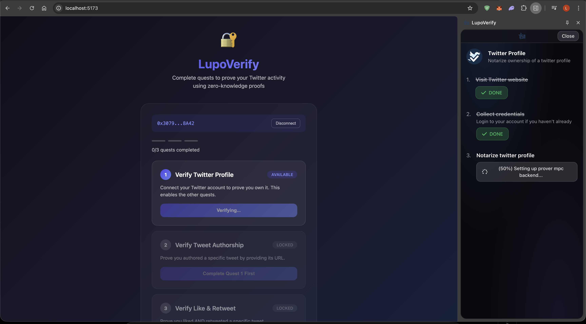
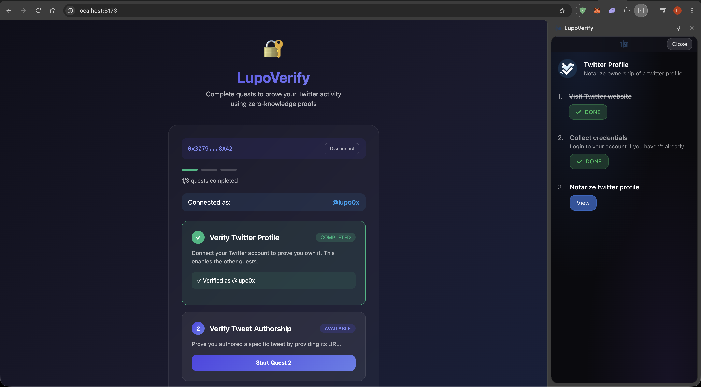

![MIT licensed][mit-badge]
![Apache licensed][apache-badge]

[mit-badge]: https://img.shields.io/badge/license-MIT-blue.svg
[apache-badge]: https://img.shields.io/github/license/saltstack/salt


# LupoVerify Extension

A fork of [TLSNotary Extension](https://github.com/tlsnotary/tlsn-extension) with custom dark glassmorphism UI theme, built for the LupoVerify ZK Twitter Quest System.

## Screenshots

| Verification In Progress | Verification Completed |
|--------------------------|------------------------|
|  |  |

## Related Repositories

- **[LupoVerify Quest System](https://github.com/LucianoLupo/zk-twitter-verifier-002)** - Full-stack ZK Twitter verification with React frontend, NestJS backend, and Rust verifier

## Changes from Upstream TLSNotary

### UI/UX
- **Dark glassmorphism theme** across all extension pages
- Custom Tailwind utilities for glass surfaces, borders, and blur effects
- Rebranded from TLSNotary to LupoVerify
- Updated popup, side panel, history, options, and approval pages

### Bug Fixes
- **Fixed Chrome MV3 async message handling** - Resolved issue where `browser.runtime.sendMessage` would return early before proof completion
- Uses explicit `sendResponse` callback pattern instead of Promise returns for long-running operations

## Features

- **MPC-TLS Notarization**: Generate cryptographic proofs of web content
- **WASM Plugin System**: Execute custom plugins for data extraction
- **Side Panel Progress**: Real-time notarization progress display
- **Dark Glass UI**: Modern, elegant glassmorphism design

## License

This repository is licensed under either of

- [Apache License, Version 2.0](http://www.apache.org/licenses/LICENSE-2.0)
- [MIT license](http://opensource.org/licenses/MIT)

at your option.

## Installing and Running

### From Source

1. Check if your [Node.js](https://nodejs.org/) version is >= **18**
2. Clone this repository:
   ```bash
   git clone https://github.com/LucianoLupo/lupo-verify-extension.git
   cd lupo-verify-extension
   ```
3. Install dependencies:
   ```bash
   npm install
   ```
4. Build the extension:
   ```bash
   npm run build
   ```
5. Load in Chrome:
   1. Go to `chrome://extensions/`
   2. Enable `Developer mode`
   3. Click `Load unpacked`
   4. Select the `build` folder

## Development

```bash
# Development build with watch mode
npm run dev

# Production build
NODE_ENV=production npm run build
```

The built extension will be in `build/` and a zip file in `zip/`.

## Running with Local Notary

### 1. Start Notary Server

```bash
# Clone and build TLSNotary
git clone https://github.com/tlsnotary/tlsn.git
cd tlsn
cargo build --release -p notary-server

# Create config directory
mkdir -p ~/.notary-server/config

# Run notary server
./target/release/notary-server --config ~/.notary-server/config/config.yaml
```

### 2. Start WebSocket Proxy

```bash
# Install wstcp
cargo install wstcp

# Run proxy for Twitter API
wstcp --bind-addr 127.0.0.1:55688 api.x.com:443
```

### 3. Configure Extension

In the extension options page, set:
- **Notary API**: `http://localhost:7047`
- **Proxy API**: `ws://localhost:55688`

## Tech Stack

| Component | Technology |
|-----------|------------|
| Framework | React 18 |
| Styling | Tailwind CSS + Custom Glass Theme |
| Build | Webpack 5 |
| Extension | Chrome Manifest V3 |
| Crypto | TLSNotary MPC-TLS |

## Project Structure

```
lupo-verify-extension/
├── src/
│   ├── assets/          # Icons and images
│   ├── components/      # Shared React components
│   ├── entries/         # Extension entry points
│   │   ├── Background/  # Service worker
│   │   ├── Content/     # Content script
│   │   ├── Popup/       # Toolbar popup
│   │   ├── SidePanel/   # Side panel UI
│   │   └── Options/     # Options page
│   ├── pages/           # Page components
│   └── utils/           # Utilities
├── build/               # Built extension (git ignored)
└── zip/                 # Packaged extension
```

## Resources

- [TLSNotary Documentation](https://docs.tlsnotary.org/)
- [TLSNotary GitHub](https://github.com/tlsnotary/tlsn)
- [Chrome Extension Documentation](https://developer.chrome.com/docs/extensions/)
